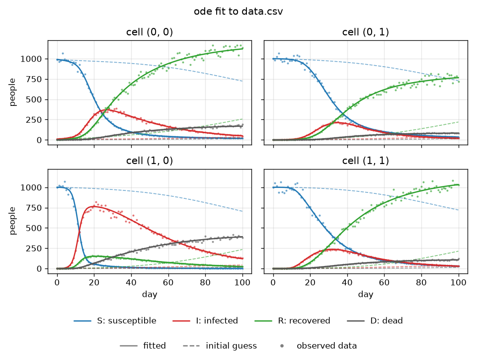

# eq_solver

Spatial SIRD toy model on a grid, solved three ways (`ode`, `discrete`, `hybrid`),
with synthetic data generation and parameter calibration. See `plan.md` for the
model and design.



## Setup

Requires [uv](https://docs.astral.sh/uv/).

```bash
uv sync
```

## Configure

Edit `config.toml`: grid size, initial population/infected, and each parameter's
`value` (truth), `guess` (calibration start) and `bounds`. Per-cell values use
`[[row0], [row1], ...]`.

## Run the experiment

```bash
# 1. Simulate and plot S/I/R/D per cell
uv run eq_solver simulate --approach ode --steps 100 --out simulate.png

# 2. Generate a synthetic dataset from the config values
uv run eq_solver make-data --approach ode --steps 100 --noise 0.05 --out data.csv

# 3. Calibrate selected parameters against the dataset
uv run eq_solver calibrate --approach hybrid --data data.csv \
    --params infection_rate,recovery_rate --plot fit.png
```

- `--approach`: `ode`, `discrete` or `hybrid`
- `--optimizer`: `lm` (Levenberg–Marquardt, default) or `adam`
- `--show`: open plots in a window

Calibrate prints the estimated values next to the config values and initial
guesses. The fit plot shows the fitted run (solid), the initial-guess run
(dashed) and the observed data (dots). Generate data with one approach and calibrate with another to see the
effect of model mismatch.

## Tests

```bash
uv run pytest
```
